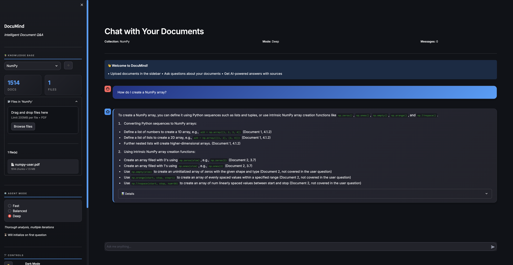

# DocuMind-Agent - Intelligent Document Q&A System

<div align="center">


**A production-ready Retrieval-Augmented Generation (RAG) system with self-correction, multi-tier document grading, and intelligent query rewriting.**

[Features](#-features) • [Architecture](#-architecture) • [Installation](#-installation) • [Usage](#-usage)


<br>
<em>Example output of the system</em>

</div>

---

## Overview

DocuMind-Agent is an advanced RAG-based question-answering system that enables intelligent conversations with your documents. Unlike basic RAG implementations, DocuMind incorporates **self-correction mechanisms**, **multi-tier relevance grading**, and **intelligent query rewriting** to deliver accurate, contextually-aware answers.

### Why DocuMind-Agent?

- **High Accuracy**: 3-tier document grading (LLM → Semantic → Keyword) ensures relevant answers
- **Self-Correcting**: Automatically rewrites queries when initial results are insufficient
- **Modular Architecture**: Clean separation using LangGraph for easy extension and maintenance
- **Production-Ready**: Comprehensive error handling, logging, and configuration management
- **Modern Stack**: Built with cutting-edge tools (LangChain, ChromaDB, Streamlit)

### Perfect For

- Research teams needing intelligent document search
- Businesses automating knowledge management
- Data scientists exploring RAG architectures

---

## Features

### Core Capabilities

- **Multi-Format Document Processing**
  - PDF ingestion with fallback loaders (PyMuPDF → Unstructured → PyPDF)
  - Intelligent text chunking with overlap for context preservation
  - Metadata extraction and preservation throughout pipeline

- **Advanced Retrieval System**
  - Vector similarity search with ChromaDB
  - Query preprocessing with conversation history enrichment
  - Intent-based keyword hints for improved retrieval
  - Configurable similarity thresholds and top-k results

- **Robust Document Grading**
  - **Primary**: LLM-based relevance assessment with confidence scoring
  - **Fallback 1**: Semantic similarity using sentence transformers
  - **Fallback 2**: Keyword overlap with coverage analysis
  - Automatic method selection based on availability and confidence

- **Self-Correction Pipeline**
  - Query rewriting when initial results are poor
  - Iterative refinement with configurable max iterations
  - Search history tracking to avoid repetition
  - Confidence-based early exit for efficiency

- **Interactive Chat Interface**
  - Modern Streamlit UI with dark/light themes
  - Real-time document upload and processing
  - Conversation history with metadata display
  - Multiple agent modes (Fast, Balanced, Deep)

- **Extensible Tool System**
  - Plug-in architecture for external tools
  - Smart routing between tools and document search
  - Error handling with fallback to document retrieval

### Technical Highlights

- **Graph-Based Orchestration**: LangGraph StateGraph for complex workflow management
- **State Management**: Comprehensive GraphState tracking with validation
- **Caching**: Query preprocessing cache and embedding reuse
- **Type Safety**: Extensive type hints with TypedDict and dataclasses
- **Testing**: Integration tests with fixtures and performance benchmarks
- **Configuration**: Centralized config with environment variable support

---

## Architecture

### System Design

DocuMind implements a sophisticated RAG pipeline with multiple stages:

```
┌─────────────────────────────────────────────────────────────┐
│                      User Question                          │
└────────────────────┬────────────────────────────────────────┘
                     │
                     ▼
┌─────────────────────────────────────────────────────────────┐
│                   Tool Routing Node                         │
│  (Determine if external tool or document search needed)     │
└────────────────────┬────────────────────────────────────────┘
                     │
                     ▼
┌─────────────────────────────────────────────────────────────┐
│                   Retriever Node                            │
│  • Query preprocessing with history enrichment              │
│  • Vector similarity search in ChromaDB                     │
│  • Result filtering by threshold                            │
└────────────────────┬────────────────────────────────────────┘
                     │
                     ▼
┌─────────────────────────────────────────────────────────────┐
│                    Grader Node                              │
│  Tier 1: LLM-based relevance assessment                     │
│  Tier 2: Semantic similarity (sentence transformers)        │
│  Tier 3: Keyword overlap analysis                           │
└────────────────────┬────────────────────────────────────────┘
                     │
                     ▼
           ┌─────────┴─────────┐
           │                   │
           ▼                   ▼
    [Sufficient?]         [Insufficient?]
           │                   │
           ▼                   ▼
┌─────────────────┐   ┌─────────────────┐
│  Generator Node │   │  Rewriter Node  │
│  (Create Answer)│   │  (Improve Query)│
└─────────────────┘   └────────┬────────┘
                               │
                               └──► [Loop back to Retriever]
```

### Component Breakdown

#### 1. **Document Processing Layer**

- **PDFLoader**: Multi-strategy PDF parsing with automatic fallback
- **TextSplitter**: Recursive character splitting with overlap
- **EmbeddingManager**: Sentence transformer model management

#### 2. **Vector Store Layer**

- **ChromaDBVectorStore**: Persistent vector database with batch operations
- Cosine similarity search with configurable thresholds
- Metadata filtering and document management

#### 3. **RAG Agent Layer**

- **RetrieverNode**: Query preprocessing and document retrieval
- **GraderNode**: Multi-tier relevance assessment
- **RewriterNode**: Intelligent query transformation
- **GeneratorNode**: Context-aware answer generation

#### 4. **Orchestration Layer**

- **LangGraph StateGraph**: Workflow management with state tracking
- **EdgeRouter**: Decision logic for graph transitions
- **StateManager**: Centralized state operations

#### 5. **UI Layer**

- **Streamlit Interface**: Interactive chat with document upload
- Real-time processing indicators
- Confidence and metadata display

### Technology Stack

| Category | Technology            | Purpose |
|----------|-----------------------|---------|
| **LLM Framework** | LangChain 1.2+        | Abstraction layer for LLM operations |
| **Orchestration** | LangGraph 1.0+        | Graph-based workflow management |
| **Vector DB** | ChromaDB 0.4+         | Embedding storage and similarity search |
| **Embeddings** | Sentence Transformers | Text-to-vector conversion |
| **LLM Backend** | Ollama                | Local LLM inference (phi3, llama3.1, mistral) |
| **UI Framework** | Streamlit 1.28+       | Interactive web interface |
| **Document Processing** | PyMuPDF, PyPDF        | PDF text extraction |
| **Testing** | Pytest 7.4+           | Unit and integration testing |

---

## Installation

### Prerequisites

- **Python 3.10+** (tested with 3.10, 3.11)
- **Ollama** installed and running ([Installation Guide](https://ollama.ai))
- **4GB+ RAM** (8GB+ recommended for larger documents)
- **Optional**: CUDA-compatible GPU for faster embeddings

### Step 1: Clone Repository

```bash
git clone https://github.com/HubertRozumek/DocuMind-Agent.git
cd documind-agent
```

### Step 2: Create Project Structure

⚠️ **Important**: The project requires a specific directory structure. Run this setup script:

```bash
# Create source directory structure
mkdir -p src/{agent/nodes,vector_store,document_processor,tools}
mkdir -p data/{vector_store/chroma,raw_documents}
mkdir -p logs

# Move files to proper locations
mv agent_builder.py edges.py graph_state.py src/agent/
mv generator_node.py grader_node.py query_rewriter.py retriever_node.py robust_grader.py grader_model.py src/agent/nodes/
mv chroma_db.py embeddings_manager.py src/vector_store/
mv pdf_loader.py text_splitter.py src/document_processor/
mv document_tool.py ticket_checker.py src/tools/

# Create __init__.py files
touch src/__init__.py
touch src/agent/__init__.py
touch src/agent/nodes/__init__.py
touch src/vector_store/__init__.py
touch src/document_processor/__init__.py
touch src/tools/__init__.py
```

### Step 3: Install Dependencies

#### Option A: Using pip (Recommended)

```bash
# Create virtual environment
python -m venv venv
source venv/bin/activate  # On Windows: venv\Scripts\activate

# Install dependencies
pip install --upgrade pip
pip install -r requirements.txt
```

#### Option B: Using Poetry

```bash
poetry install
poetry shell
```

### Step 4: Configure Environment

Create a `.env` file in the project root:

```bash
# .env
# Ollama Configuration
OLLAMA_BASE_URL=http://localhost:11434
OLLAMA_GRADER_MODEL=phi3:mini
OLLAMA_GENERATOR_MODEL=llama3.1:8b
OLLAMA_REWRITER_MODEL=mistral:7b

# Vector Store
CHROMA_PERSIST_DIR=data/vector_store/chroma
CHROMA_DEFAULT_COLLECTION=documents

# Embedding Model
EMBEDDING_MODEL_TYPE=MPNET
EMBEDDING_DEVICE=cpu  # or 'cuda' for GPU

# Agent Configuration
MAX_ITERATIONS=3
SEARCH_THRESHOLD=0.7
GRADER_CONFIDENCE_THRESHOLD=0.6
RETRIEVAL_TOP_K=5

# Document Processing
CHUNK_SIZE=400
CHUNK_OVERLAP=50
MAX_FILE_SIZE_MB=50

# Logging
LOG_LEVEL=INFO
```

### Step 5: Download Ollama Models

```bash
# Download required models (may take several minutes)
ollama pull phi3:mini       # Fast grading model (~2GB)
ollama pull llama3.1:8b     # Generation model (~4.7GB)
ollama pull mistral:7b      # Query rewriting model (~4.1GB)

# Verify models are available
ollama list
```

### Step 6: Verify Installation

```bash
# Run tests to verify setup
pytest tests/ -v

# Or run a quick integration test
python -m pytest tests/test_integration.py::test_pdf_to_vector_store_pipeline -v
```

---

## Usage

### Starting the Application

```bash
# Activate virtual environment
source venv/bin/activate  # On Windows: venv\Scripts\activate

# Start Streamlit app
streamlit run streamlit_app/app.py
```

The application will open in your browser at `http://localhost:8501`

### Using the UI

#### 1. **Create a collection**

- Click the **"+"** in the Knowledge Base section
- In the "Collection Name" field, enter the name of the new collection
- Press **"Create"**

#### 2. **Upload Documents**

- Click **"Browse files"** in the sidebar
- Select one or more PDF files (max 50MB each)
- Click **"Process Documents"**
- Wait for processing to complete

#### 3. **Ask Questions**

- Type your question in the chat input
- Press Enter or click Send
- The agent will:
  - Retrieve relevant documents
  - Grade their relevance
  - Generate an answer with sources

#### 4. **Adjust Settings**

- Choose agent mode:
  - **Fast**: Single iteration, quick responses
  - **Balanced**: 2 iterations, optimal quality
  - **Deep**: 4 iterations, thorough analysis
- Toggle theme (light/dark)
- View confidence scores and metadata

### Programmatic Usage

#### Basic RAG Query

```python
from src.agent.agent_builder import create_agent
from src.vector_store.embeddings_manager import EmbeddingManager
from src.vector_store.chroma_db import ChromaDBVectorStore

# Initialize embedding manager
embedding_manager = EmbeddingManager()
embedding_function = embedding_manager.chroma_embedding_function()

# Create vector store
vector_store = ChromaDBVectorStore(
    collection_name="documents",
    persist_directory="data/test/chroma",
    embedding_function=embedding_function,
    reset_on_start=True,
    client= None
)

# Create agent
agent = create_agent(
    vector_store_config={
        "collection_name": "documents",
        "persist_directory": "data/test/chroma",
        "client": None
    },
    max_iterations=3,
    use_tools=True
)

# Query the agent
response = agent.invoke("What are the main findings in the research papers?")

print(f"Answer: {response['answer']}")
print(f"Confidence: {response['confidence']:.2%}")
print(f"Sources: {len(response['relevant_documents'])} documents")
```

#### Processing Documents

```python
from src.document_processor.pdf_loader import PDFLoader
from src.document_processor.text_splitter import TextSplitter
from src.vector_store.chroma_db import ChromaDBVectorStore

# Load PDF
loader = PDFLoader(loader_type="auto")
documents = loader.load_pdf("path/to/document.pdf")

# Split into chunks
splitter = TextSplitter(chunk_size=400, chunk_overlap=50)
chunks = splitter.split_documents(documents)

# Add to vector store
vector_store = ChromaDBVectorStore(collection_name="my_docs")
docs_to_add = [
    {"id": chunk.chunk_id, "text": chunk.text, "metadata": chunk.metadata}
    for chunk in chunks
]
count = vector_store.add_documents(docs_to_add)
print(f"Added {count} chunks to vector store")
```

#### Custom Grading Configuration

```python
from src.agent.nodes.robust_grader import RobustGrader, GraderConfig

# Create custom grading configuration
config = GraderConfig(
    llm_min_confidence=0.7,
    semantic_highly_relevant=0.8,
    keyword_highly_relevant=0.7,
    relevance_threshold=0.65
)

# Initialize grader with custom config
grader = RobustGrader(
    model_name="phi3:mini",
    config=config
)

# Grade a document
result = grader.grade(
    question="What is machine learning?",
    document="Machine learning is a subset of artificial intelligence..."
)

print(f"Relevance: {result.score.name}")
print(f"Confidence: {result.confidence:.2%}")
print(f"Method: {result.method}")
print(f"Reason: {result.reason}")
```

### API Response Format

```python
{
    "answer": "The generated answer text...",
    "confidence": 0.85,  # 0.0 to 1.0
    "iterations_used": 2,
    "max_iterations": 3,
    "tool_used": None,  # or tool name if external tool was used
    "relevant_documents": [
        "Document chunk 1 text...",
        "Document chunk 2 text..."
    ],
    "metadata": {
        "agent_version": "3.1-robust-grader",
        "retrieval_results": {...},
        "grading_result": {
            "relevant_count": 5,
            "avg_confidence": 0.82,
            "relevance_ratio": 0.83
        }
    },
    "state_summary": {
        "question": "Original question",
        "has_answer": True,
        "documents_found": 10,
        "relevant_documents": 5,
        "needed_rewrite": False,
        "tool_was_used": False
    }
}
```

---

## Testing

### Running Tests

```bash
# Run all tests
pytest tests/ -v

# Run specific test suite
pytest tests/test_integration.py -v

# Run with coverage
pytest tests/ --cov=src --cov-report=html

# Run performance tests only
pytest tests/ -v -m performance
```

### Test Structure

```
tests/
├── conftest.py                    # Shared fixtures
├── test_agent_builder.py          # Agent initialization tests
├── test_chromadb.py               # Vector store tests
├── test_grader.py                 # Document grading tests
├── test_integration.py            # End-to-end pipeline tests
├── test_pdf_loader.py             # PDF processing tests
├── test_retriever_and_embeddings.py  # Retrieval tests
└── test_text_splitter.py          # Chunking tests
```

---

## Configuration

### Environment Variables

| Variable | Default | Description |
|----------|---------|-------------|
| `OLLAMA_BASE_URL` | `http://localhost:11434` | Ollama server URL |
| `OLLAMA_GRADER_MODEL` | `phi3:mini` | Model for document grading |
| `OLLAMA_GENERATOR_MODEL` | `llama3.1:8b` | Model for answer generation |
| `OLLAMA_REWRITER_MODEL` | `mistral:7b` | Model for query rewriting |
| `CHROMA_PERSIST_DIR` | `data/vector_store/chroma` | ChromaDB storage path |
| `CHROMA_DEFAULT_COLLECTION` | `documents` | Default collection name |
| `EMBEDDING_MODEL_TYPE` | `MPNET` | Embedding model to use |
| `EMBEDDING_DEVICE` | `None` | Device for embeddings (cpu/cuda/mps) |
| `MAX_ITERATIONS` | `3` | Max query rewrite iterations |
| `SEARCH_THRESHOLD` | `0.7` | Minimum similarity threshold |
| `GRADER_CONFIDENCE_THRESHOLD` | `0.6` | Minimum grading confidence |
| `RETRIEVAL_TOP_K` | `5` | Number of documents to retrieve |
| `CHUNK_SIZE` | `400` | Text chunk size in characters |
| `CHUNK_OVERLAP` | `50` | Overlap between chunks |
| `MAX_FILE_SIZE_MB` | `50` | Maximum PDF file size |
| `LOG_LEVEL` | `INFO` | Logging level |

### Agent Modes

Configure agent behavior with different presets:

```python
AGENT_PRESETS = {
    "Fast": {
        "model": "phi3:mini",
        "temperature": 0.2,
        "iterations": 1,
        "description": "Quick responses, single iteration"
    },
    "Balanced": {
        "model": "phi3:mini",
        "temperature": 0.1,
        "iterations": 2,
        "description": "Optimal speed/accuracy balance"
    },
    "Deep": {
        "model": "mistral:7b",
        "temperature": 0.0,
        "iterations": 4,
        "description": "Thorough analysis, multiple iterations"
    }
}
```

---

## Troubleshooting

### Common Issues

#### 1. **ImportError: No module named 'src'**

**Problem**: Import paths not set up correctly

**Solution**: Ensure you've created the `src/` directory structure as shown in installation steps, or add project root to Python path:

```python
import sys
from pathlib import Path
sys.path.insert(0, str(Path(__file__).parent))
```

#### 2. **Ollama Connection Error**

**Problem**: Cannot connect to Ollama server

**Solution**:

```bash
# Check if Ollama is running
curl http://localhost:11434/api/tags

# Start Ollama if not running
ollama serve

# Verify models are downloaded
ollama list
```

#### 3. **ChromaDB Persistence Error**

**Problem**: `sqlite3.OperationalError: database is locked`

**Solution**:

```bash
# Close all connections to the database
pkill -9 python  # Caution: kills all Python processes

# Or use a different persistence directory
export CHROMA_PERSIST_DIR=data/vector_store/chroma_new
```

#### 4. **Out of Memory**

**Problem**: System runs out of RAM during embedding

**Solution**:

```python
# Reduce batch size in config.py
batch_size: int = 50  # Default is 100

# Or process documents in smaller batches
# Or use CPU instead of GPU for embeddings
export EMBEDDING_DEVICE=cpu
```

#### 5. **Slow Document Processing**

**Problem**: PDF processing takes too long

**Solution**:

```bash
# Use faster PDF loader
export PDF_LOADER_TYPE=pymupdf  # Fastest option

# Reduce chunk size for faster processing
export CHUNK_SIZE=300
export CHUNK_OVERLAP=30
```

---

## 📜 License

This project is licensed under the **MIT License** - see the [LICENSE](LICENSE) file for details.

### MIT License Summary

- ✅ Commercial use
- ✅ Modification
- ✅ Distribution
- ✅ Private use
- ⚠️ Liability limited
- ⚠️ No warranty

```
MIT License

Copyright (c) 2026 Hubert Rozumek

Permission is hereby granted, free of charge, to any person obtaining a copy
of this software and associated documentation files (the "Software"), to deal
in the Software without restriction, including without limitation the rights
to use, copy, modify, merge, publish, distribute, sublicense, and/or sell
copies of the Software, and to permit persons to whom the Software is
furnished to do so, subject to the following conditions:

The above copyright notice and this permission notice shall be included in all
copies or substantial portions of the Software.

THE SOFTWARE IS PROVIDED "AS IS", WITHOUT WARRANTY OF ANY KIND, EXPRESS OR
IMPLIED, INCLUDING BUT NOT LIMITED TO THE WARRANTIES OF MERCHANTABILITY,
FITNESS FOR A PARTICULAR PURPOSE AND NONINFRINGEMENT.
```

---

## References & Resources

### Learning Resources

- [LangChain Documentation](https://python.langchain.com/)
- [LangGraph Tutorial](https://langchain-ai.github.io/langgraph/)
- [ChromaDB Guide](https://docs.trychroma.com/)
- [Ollama Documentation](https://docs.ollama.com/quickstart)
- [RAG Best Practices](https://www.pinecone.io/learn/retrieval-augmented-generation/)

### Citations

If you use DocuMind-Agent in research or publications:

```bibtex
@software{documind2024,
  author = {Hubert Rozumek},
  title = {DocuMind-Agent: Intelligent Document Q&A System},
  year = {2026},
  publisher = {GitHub},
  url = {https://github.com/HubertRozumek/DocuMind-Agent}
}
```

---

## Contact & Support

### Get In Touch

- **Email**: <hubert.rozumek9@gmail.com>
- **GitHub**: [Hubert](hhttps://github.com/HubertRozumek)

---

### Version History

- **v1.0.0** (Current): Initial release with core RAG functionality

---

<div align="center">

**Built with ❤️ for the AI/ML Community**

[⬆ Back to Top](#-documind---intelligent-document-qa-system)

</div>
